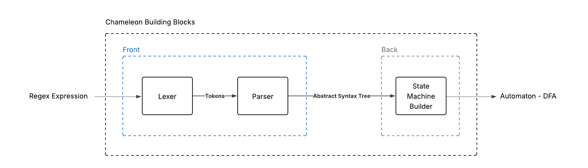

[](#)
[](https://choosealicense.com/licenses/mit/)
[](#)

A minimal, blazing-fast regular expression engine built from scratch.<br>
Designed to be simple, educational, and flexible — like a chameleon adapting to any pattern!

## Table of Contents
- [What is Chameleon?](#-what-is-chameleon)
- [Features](#-features)
- [Architecture Overview](#-architecture-overview)
- [Usage](#-usage)
- [Contributing](#-contributing)

## 📘 What is Chameleon?
Inspired by the chameleon’s remarkable ability to adapt and change colors seamlessly.<br> 
**Chameleon** is a lightweight, high-performance regular expression engine built from scratch, just like its namesake, it adapts fluidly to diverse patterns — switching, matching, and optimizing on demand.

Engineered for speed, clarity, and educational insight, Chameleon offers a clean and efficient way to explore how pattern matching truly works under the hood.

> **Current supported operators:**
> ```
> |   # Alternation (matches either pattern)
> *   # Kleene star (matches zero or more repetitions)
> ()  # Grouping (defines subpatterns)
> `   # Escape character (treats special symbols literally)
> ```

> **Possible enhancements:** `+`, `?`, `{n,m}`, and character classes `[]`

Built for learning, experimentation, and embedding in other projects.

## ✨ Features
This open-source project includes the following features:<br>
⚙️ Minimal core design — no external dependencies<br>
🚀 Lightweight — optimized for small footprint<br>
🧩 Extensible — easy to add new regex operators<br>
📚 Educational and well-documented — clear structure for learning regex internals<br>

## ⚙ Architecture Overview
Chameleon’s architecture consists of two main modules, each with a distinct role.
- The **Front-Module** includes the lexer and parser responsible for analyzing and interpreting regex patterns.
- The **Back-Module** contains the builder that constructs the internal regex matching engine.



| Module                | Input   | Output    | Details |
|------------------------|----------|-----------|----------|
| **Lexer**              | Regex pattern | Tokens | Takes the regex as input and tokenizes it into elementary components. |
| **Parser**             | Tokens | Abstract Syntax Tree (AST) | Parses the sequence of tokens and builds the corresponding AST structure. |
| **State Machine Builder** | AST | Automaton | Converts the AST into a Thompson NFA, then transforms it into an NFA, and finally into a deterministic finite automaton (DFA). |

## 🔨 Usage
After cloning the repository to your local machine, you can experiment with the modules individually — performing lexing, parsing, or directly using the regex engine to match patterns.<br>
```python
from core.lexer.lexer import Lexer
from core.parser.parser import Parser

# Tokenization using Lexer module
tokens = Lexer.tokenize('a*b|c')
print(tokens)

# Syntax analysis using the Parser module
ast = Parser.parse(tokens)
print(tokens)
```
```markdown
Output: 
>> [Token(TokenType.T_LITERAL, 'a'), Token(TokenType.T_KLEENE_CLOSURE, '*'), Token(TokenType.T_LITERAL, 'b'), Token(TokenType.T_PIPE, '|'), Token(TokenType.T_LITERAL, 'c')]
>> PipeNode(ConcatNode(KleeneNode(LiteralNode('a')), LiteralNode('b')), LiteralNode('c'))
```

```python
from core.regex import Regex

# Direct matching using the Regex module
truth = Regex.match('aaab', 'a*b|c')
print("Matching" if truth else "Unmatched")
```
```markdown
Output:
>> Matching
```

## 🤝 Contributing

We welcome contributions, suggestions, and feedback! Whether it’s fixing bugs, implementing new features, or improving documentation, your help is appreciated. Follow these steps to get started:

1. Fork the repository
2. Clone your fork locally
```bash
git clone https://github.com/youssefhj/regex-engine-chameleon.git
cd regex-engine-chameleon
```
3. Create a new branch for your changes
```bash
git checkout -b feature/your-feature-name
```
4. Make your changes
- Follow the existing code style.
- Write clear and descriptive commit messages.
- Ensure your changes are tested.
5. Push your branch and submit a Pull Request
```bash
git push origin feature/your-feature-name
```
Then open a Pull Request on GitHub and describe your changes clearly.